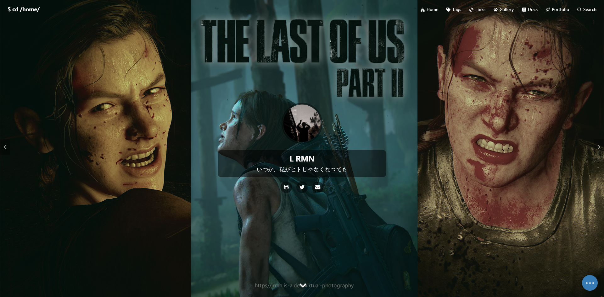

<div align="center">
  
</div>

###

<h3 align="left">Connect with me:</h3>
<p align="left">
<a href="https://twitter.com/romanromannya" target="blank"></a>
<a href="https://instagram.com/romanroman.nya" target="blank"></a>
<a href="https://www.youtube.com/c/lrmn_vp" target="blank"></a>
<a href="https://discord.gg/WFfjrQxnfH" target="blank"></a>
</p>

###

<h1 align="center">hey there 👋</h1>

###

<div align="center">
  
</div>

###


 <h4 align="left">💔 love has a cost, and both of us lost</p></h4>

###

<h3 align="left"> What i'am listening to </h3>


###

Support me

- 👉 🇮🇩 [Trakteer](https://trakteer.id/romanromannya)
- 👉 🌍 [BuyMeACoffe](https://www.buymeacoffee.com/lrmn)
- 👉 🌍 [Ko-Fi](https://ko-fi.com/lrmn7)

###

# Hi! 🧐

[](https://lrmn.is-a.dev/blog) [](https://github.com/lrmn7/daily-dev) [](https://github.com/vuejs/vuepress) [](LICENSE)


This is my blog, it is powered by [VuePress 2](https://v2.vuepress.vuejs.org/)

Any way, just have fun with this blog: [lrmn.is-a.dev/daily-dev](https://lrmn.is-a.dev/daily-dev/)


&nbsp;

## Usage

Clone the repo and install dependencies:

```bash
pnpm i
```

Start developing the site:

```bash
pnpm dev
```

Build for production with minification:

```bash
pnpm build
```
##
<div align="center">
  
</div> 

&nbsp;

## License

This blog is [Apache License 2.0](https://www.apache.org/licenses/LICENSE-2.0) licensed, see the [LICENSE](LICENSE) file for details.
